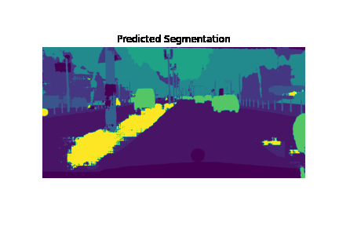
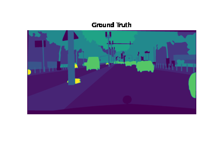

# biweekly-report-6-cryptonymous9

## `FCN.ipynb`:

- Processing and analysis of CityScapes Dataset
- Pytorch implementation of _Fully convolutional networks (FCN) for semantic segmentation_.
- Inference and post training analysis of FCN.
- Some visualizations based on FCN predictions.
 
 

## Animation
Due to some rendering issues, Github wan't loading the GIFs in jupyter notebook, so here they are:

</img>

</img>

</img>
